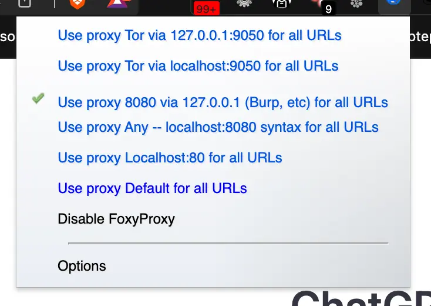
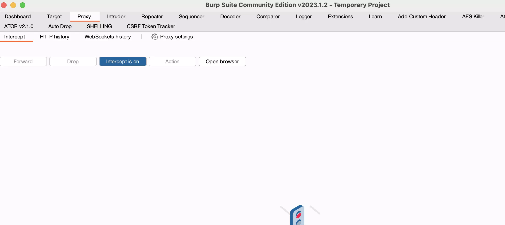
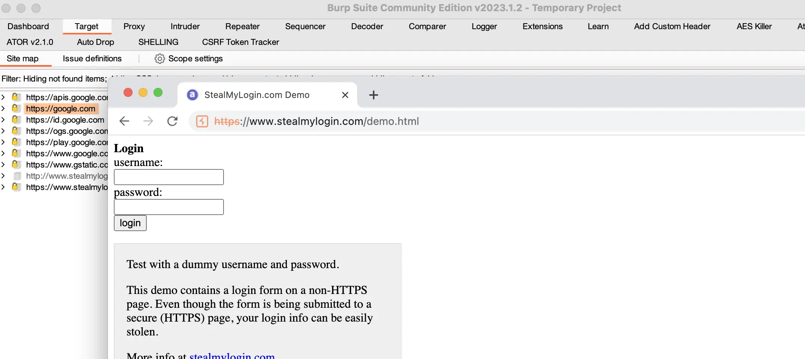
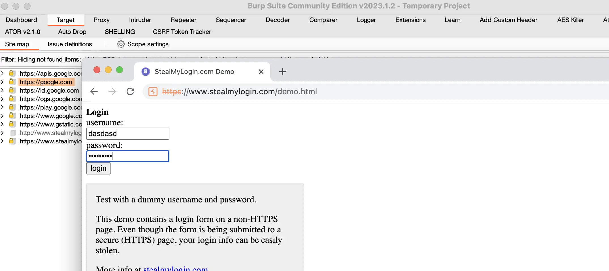
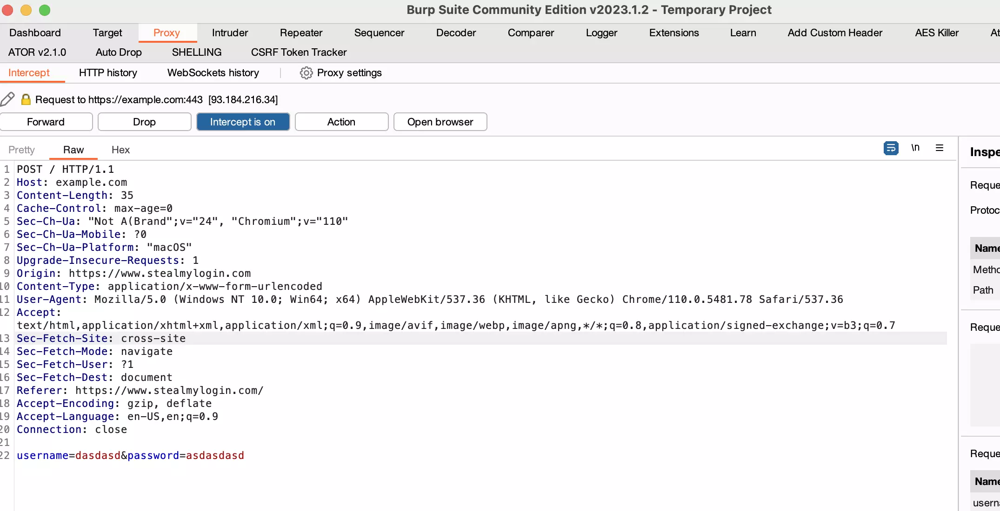
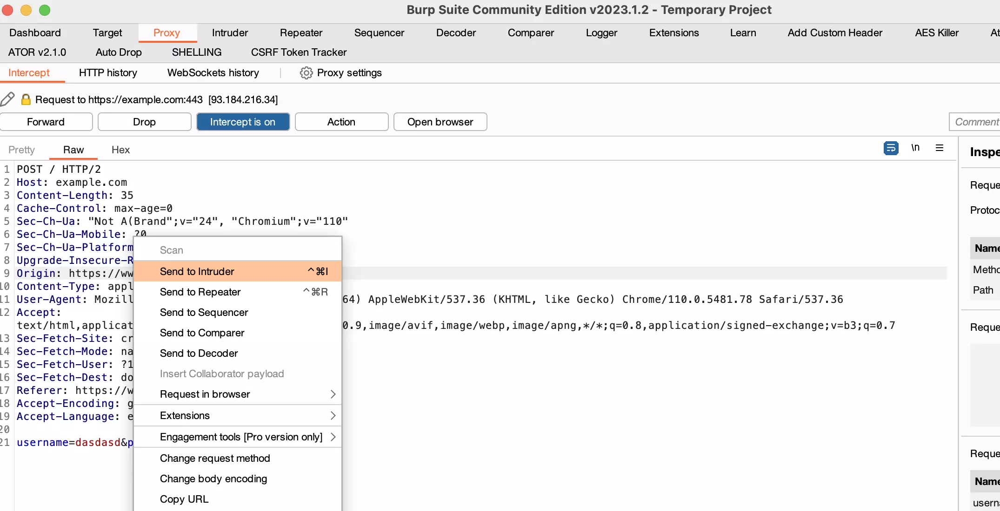
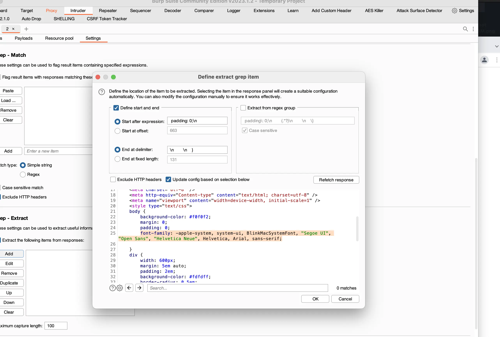
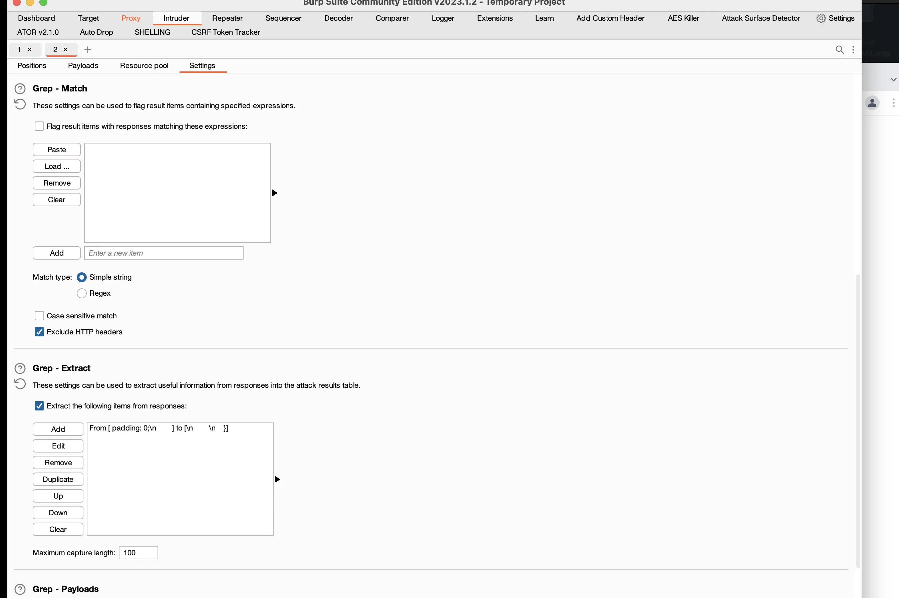
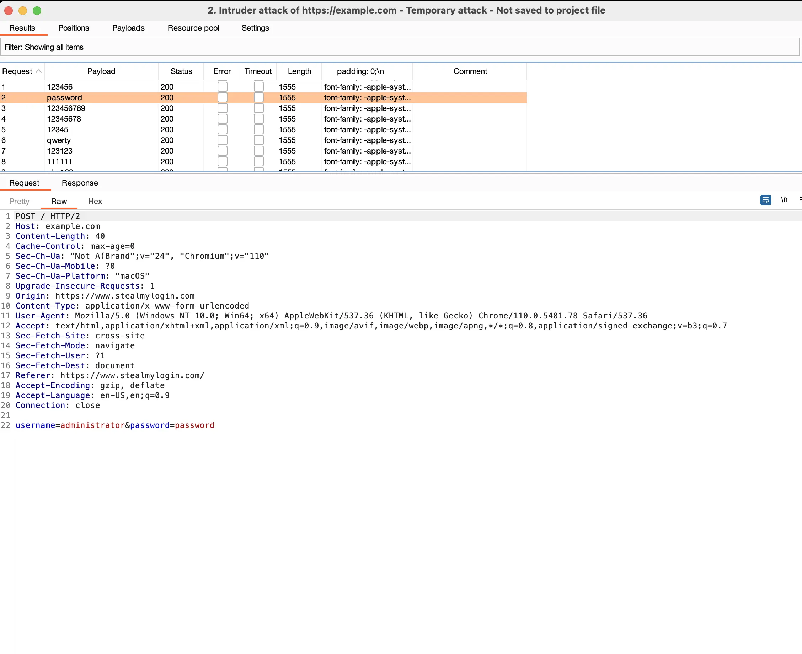
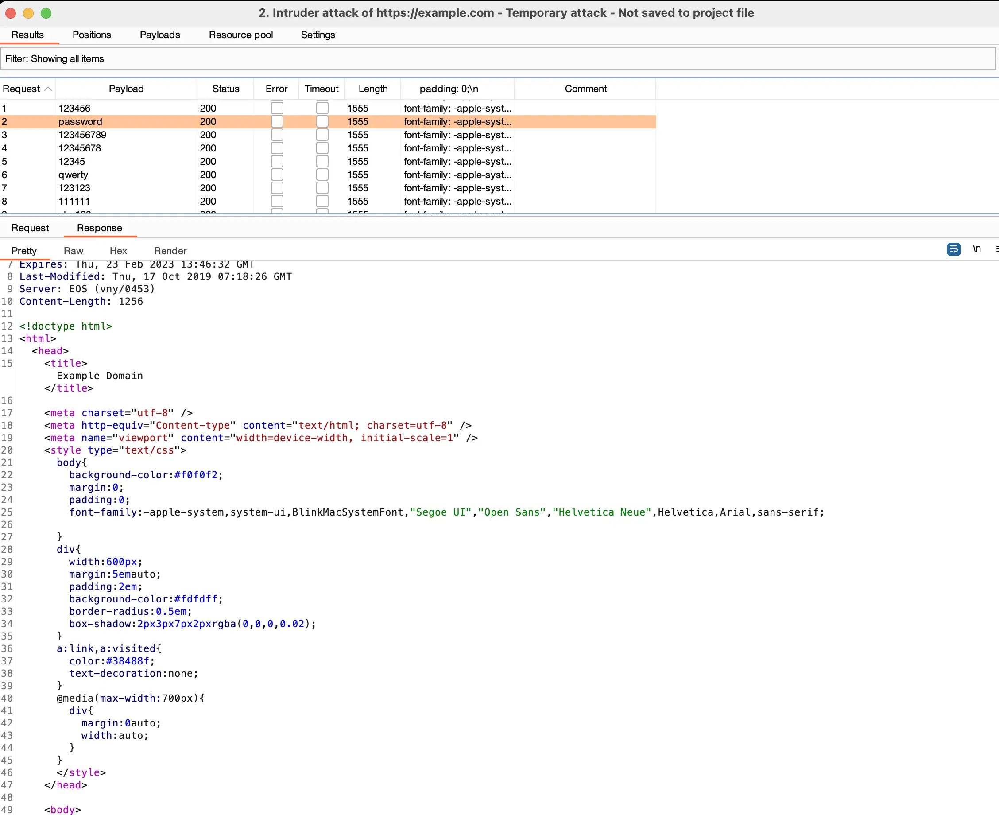

# **What is BurpSuite?**
Burp Suite is a popular and powerful set of tools used for web application security testing. It was developed by PortSwigger and is widely used by security professionals, ethical hackers, and developers. Burp Suite consists of several modules that can be used for different purposes, such as intercepting and modifying HTTP/S traffic, scanning web applications for vulnerabilities, brute-forcing authentication, and testing for various types of attacks. The tool also provides detailed reports and allows for customizing and automating testing workflows, making it a versatile and efficient tool for identifying and addressing security issues in web applications.

# Setup
I won't go into install because it's no different than installing any application. Setup is important though, as BurpSuite sits inbetween your browser and the traffic coming/going. That requires FoxyProxy extension, or to alter your browsers proxy settings.

You add FoxyProxy extension, open it, and add a proxy setting with localhost/127.0.0.1 for the IP setting and 8080 for the port setting. Make sure the Proxy is active.

With Foxy Proxy on and BurpSuite open, we need to turn on intercept with Burp. 

From there we can navigate to the form

Let's fill it out, send it and see what happends

We see the forms POST request coming in from intercept...

We need to send that request to the intruder section...

From there we can load a password list...

A few more configs need to be made...

We need to define what a failure is. This is going to be a bad example, because this doesn't have the typical failure message but I had to use a form legally. So this is how you WOULD, typically extract the failure message inside Burps settings for this session.

So in a normal situation that highlighted text would be the part of the response it returns on failure. We can run the test now. 

If we look at each request/response...

I'll work on a better example, or build my own form to show a better example because of liability I can't just crack any random form on the internet for a demo. The typical output, if this form had a failure string you'd be able to clearly see when it was successful or failed. It's the same concept.
