# Hacking WiFi
## What do I mean by 'hacking'?
Obtaining the credentials for the WiFi network, or at the minimum a handshake or PKMS to attempt to crack with Aircrack-ng or Hashcat. 

## Tools Used
- Kali Linux VM
- Airgeddon
- Aircrack-ng OR Hashcat
- Wordlists(seclists in this case, rockyou.txt)
- TP-Link WN722 Wireless Adapter, which takes a bit of modding the driver but does support monitor mode and packet injection. As well as AP and clients. I got this adapter because I wanted one with all four. 

So, if you on Kali and already have your adapter setup(which is a different tutorial), these are the steps to cracking a WiFi network.

## Process

We are going to need to capture a handshake or PKMS to run a wordlist against. We will do with airgeddon.

Starting airgreddon,

`sudo airgeddon`

When airgeddon is starting, it will go through a list of packages that need to be installed for full function. Just copy, paste, and download those.

`sudo apt install <packages named by airgeddon`

Now, fire up airgeddon again and make sure the checklist has everything installed.

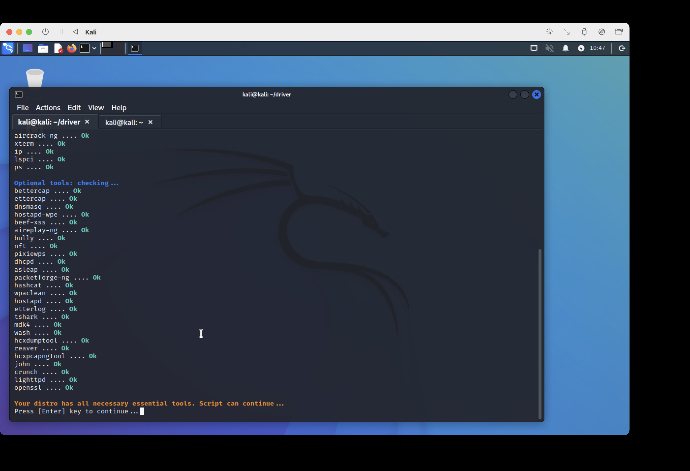

Proceed by choosing the adapter you want to use...

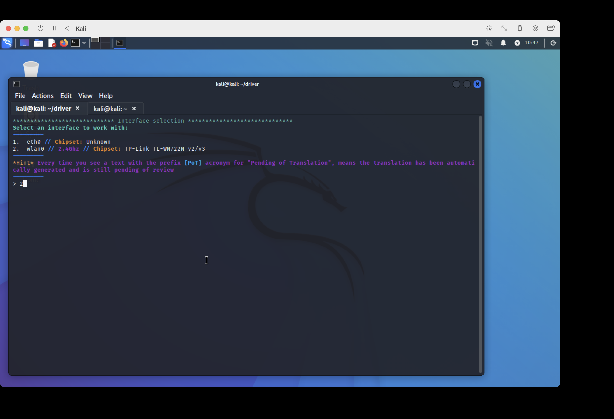

Then we want to make sure airgeddon recognizes the card as being in monitor mode, sometimes it doesn't so it's good to just hit 2 before moving forward.

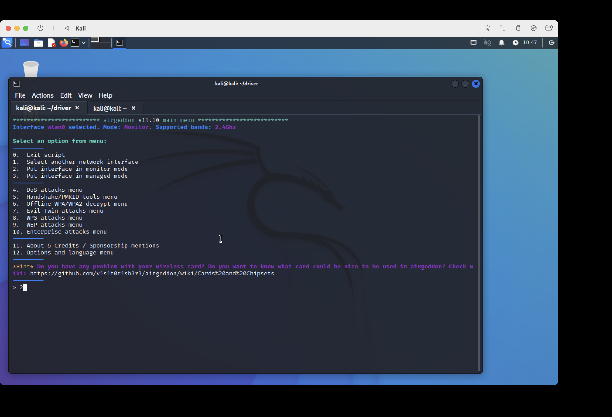

Now we can deauth and capture PKMS or Handshakes

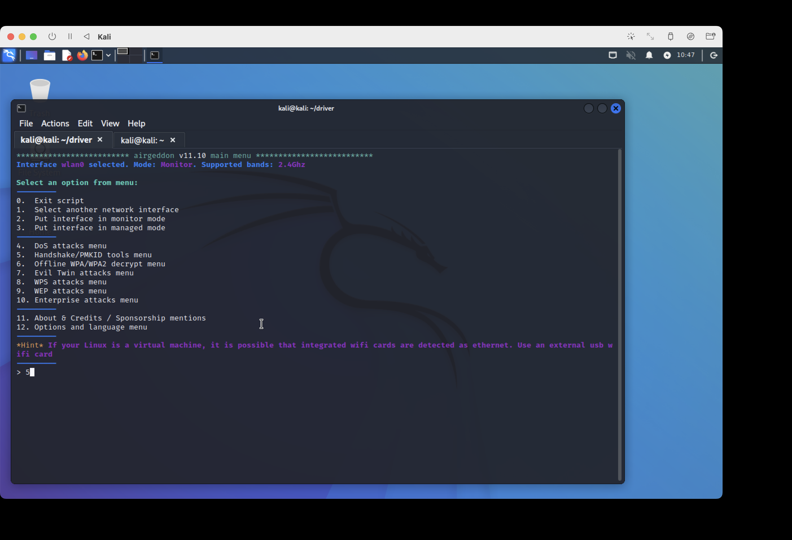

In Monitor mode and ready to scan for target WiFi's **which we only ever test on our own network**

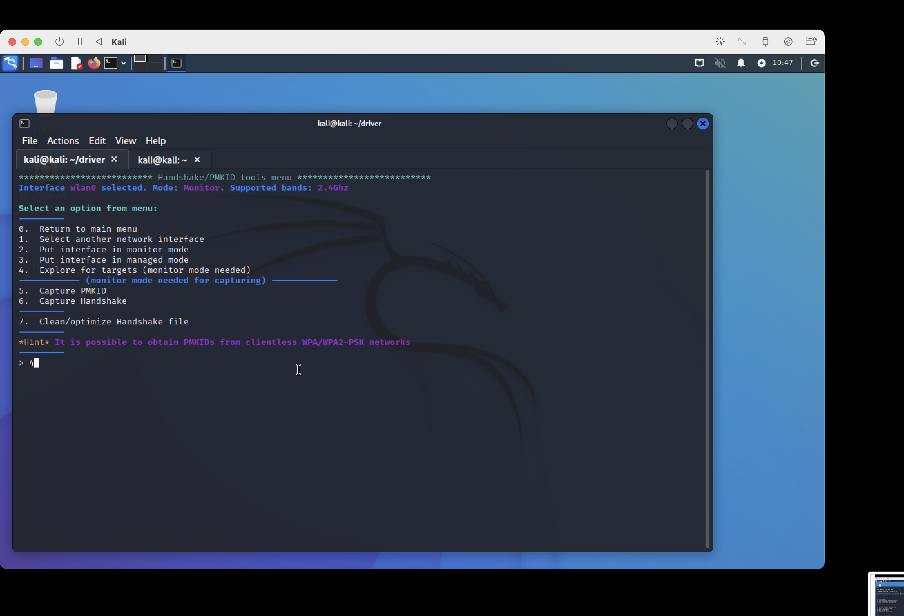

I am the qwhat WiFi network, just a temporary guest network I setup for this demo.

This is what it looks like while searching for targets, when enough have appeared you close the window that lists them.

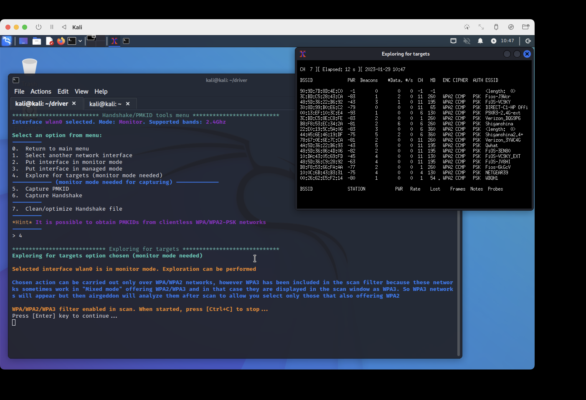

Let's select my network

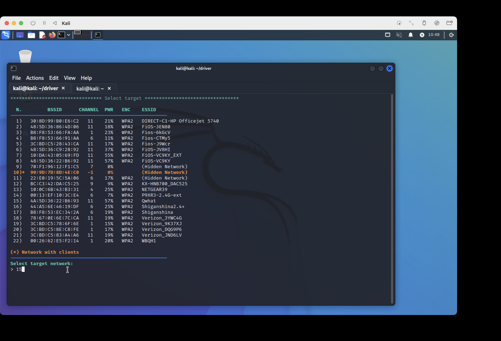

and select capture handshake, because it will search for both. PKMS will only search for PKMS, so I find handshake is the best of both worlds.

Now we select the way in which it will deauth clients on our selected network, so they are forced to reconnect, allowing us to catch the PKMS/Handshake.

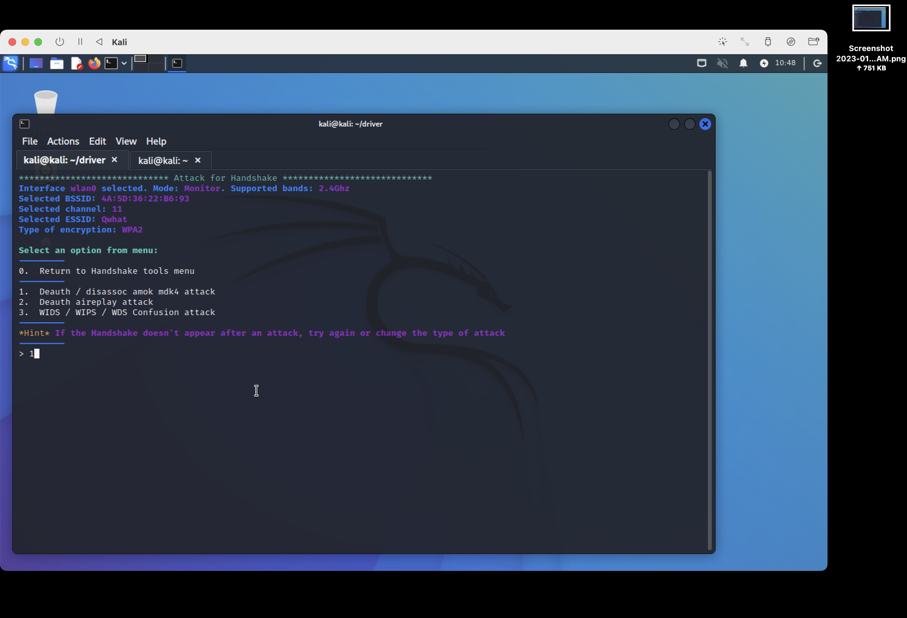
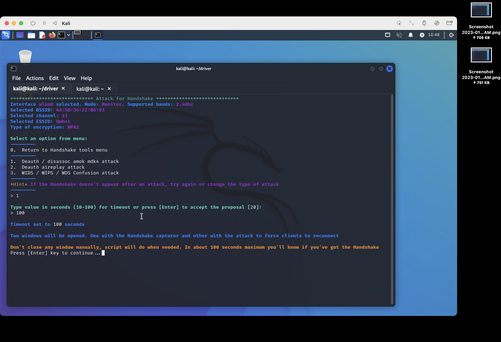

We have a captured handshake! Now just to crack it. If we return to airgeddon's main menu, they have an option for that.

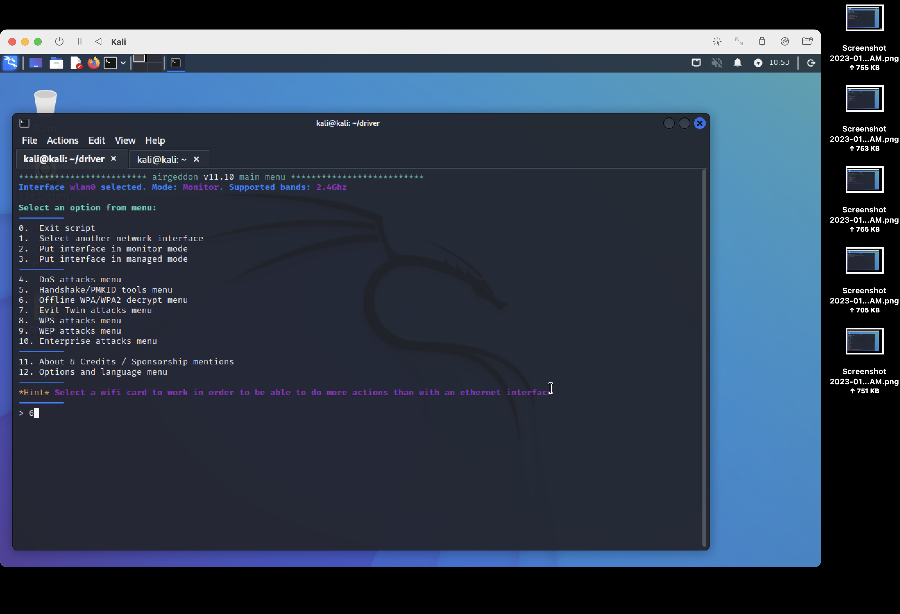
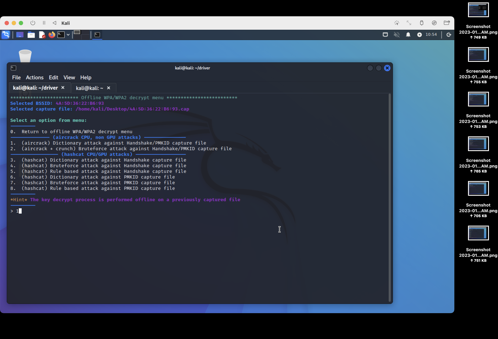

I won't show the password, but you get the point.

Thank you for reading. More to come with this adapter, access points, clients, advanced bettercap + beef-xss usage and more! I would love some recommendations for hacking topics to cover.

**Please always use your own network, and be considerate of others.**

