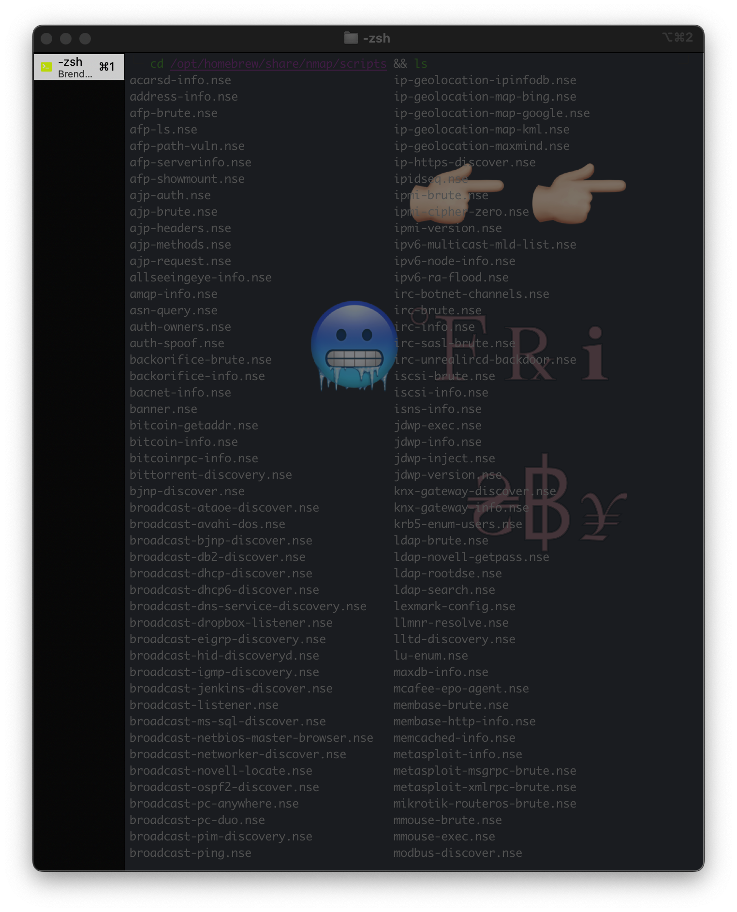

------------
# Next Level Nmap Scripts
## By Brendan Frisby
I want to talk about nmap scripts, because I often see that things on Metasploit about 75% of the modules can also be accomplished using Nmap. At this time there are 595 NSE scripts that come along with Nmap. They are continiously updated and the number fluctuates. These scripts are also conveniently seperated into catageroies and we will go in to why I think that's important later. First let's make sure everyone is up and running. We are about to get deep into nmap, and by the end of this read you will be able to use every NSE script within the Nmap framework like a professional.
----------
### Some recources I made awhile ago - [Notion Page on Nmap Scripts](https://www.notion.so/alwayspwnable/Nmap-Scripts-28c7b4cb923e4785b9d189a6ddae4e0e)
--------------
Okay so depending what OS you are on, and what package manager you are using you will need to install Nmap differently. I'n my current case on a Mac M1 with Homebrew so mine would look like this....

`brew install nmap`

Yours may be...

`sudo apt install nmap` 
 
`sudo apt-get install nmap`
  
`macports install nmap`
   
`Any Package Manager install nmap`
 
Now that we have nmap, let's find the scripts and have a look.  

*Mine are located at /opt/homebrew/share/nmap/scripts so I will...

  `cd /opt/homebrew/share/nmap/scripts`

Other locations are 

`/usr/local/share/nmap/scripts`

`/share/nmap/scripts`

`cd /share/nmap/scripts`

I suggest looking around at these, using tools like less/cat to take a look at the actual file and usage of it when called. You want to look at the script arguements to see the correct way to run a script.

  `ls`

  `ls | grep http`

  `ls | grep brute`

        afp-brute.nse
        ajp-brute.nse
        backorifice-brute.nse
        cassandra-brute.nse
        cics-user-brute.nse
        citrix-brute-xml.nse
        cvs-brute-repository.nse
        cvs-brute.nse
        deluge-rpc-brute.nse
        dicom-brute.nse
        dns-brute.nse
        domcon-brute.nse
        dpap-brute.nse
        drda-brute.nse
        ftp-brute.nse
        http-brute.nse
        http-form-brute.nse
        http-iis-short-name-brute.nse
        http-joomla-brute.nse
        http-proxy-brute.nse
        http-wordpress-brute.nse
        iax2-brute.nse
        imap-brute.nse
        informix-brute.nse
        ipmi-brute.nse
        irc-brute.nse
        irc-sasl-brute.nse
        iscsi-brute.nse
        ldap-brute.nse
        membase-brute.nse
        metasploit-msgrpc-brute.nse
        metasploit-xmlrpc-brute.nse
        mikrotik-routeros-brute.nse
        mmouse-brute.nse
        mongodb-brute.nse
        ms-sql-brute.nse
        mysql-brute.nse
        nessus-brute.nse
        nessus-xmlrpc-brute.nse
        netbus-brute.nse
        nexpose-brute.nse
        nje-node-brute.nse
        nje-pass-brute.nse
        nping-brute.nse
        omp2-brute.nse
        openvas-otp-brute.nse
        oracle-brute-stealth.nse
        oracle-brute.nse
        oracle-sid-brute.nse
        pcanywhere-brute.nse
        pgsql-brute.nse
        pop3-brute.nse
        redis-brute.nse
        rexec-brute.nse
        rlogin-brute.nse
        rpcap-brute.nse
        rsync-brute.nse
        rtsp-url-brute.nse
        sip-brute.nse
        smb-brute.nse
        smtp-brute.nse
        snmp-brute.nse
        socks-brute.nse
        ssh-brute.nse
        svn-brute.nse
        telnet-brute.nse
        tso-brute.nse
        vmauthd-brute.nse
        vnc-brute.nse
        xmpp-brute.nse

  `ls | grep form`

      http-form-brute.nse
      http-form-fuzzer.nse
      informix-brute.nse
      informix-query.nse
      informix-tables.nse
-----------

[I highly reccommend bookmarking this. It is a list of every nmap script and information about each](https://www.infosecmatter.com/nmap-nse-library/)

-----------
## [Check me out on Github](https://github.com/bfrisbyh92)
---------

I am going to do a few common tasks that both Nmap and Metasploit can be used for. Sometimes Nmap even has an advantage over Metasploit. A good example of that is Nmap has two modules for the Slowloris DOS(A Vulnerability Check, and the actual DOS attack module). Metasploit only has the DOS attack. So It's important to know the best tool for the specific job you are working on. 
---------------------------

> I'll give a few examples how nmap scipting can be used. Also going to share a few tips and tricks. 

## 1. HTTP GET Form Brute

Typically, I want to look at and inspect the script first so I can see how it needs to be called and with what script args.

`less http-form-brute.nse`

`w3m http-form-brute.nse`

`cat http-form-brute.nse`

These commands above are all the same, just different ways of viewing the file. w3m would need to be installed to work, but it's a good favorite of mine to see files or links in temrinal 

-----------------------

[Copy of the script here](../public/assets/blogs-media/5-apis-to-inspire-you-for-your-next-project/http-form-brute.txt)

##### But this is what I am generally looking for from the file. Usage and arguments.

      -- @usage
      -- nmap --script http-form-brute -p 80 <host>
      --
      -- @output
      -- PORT     STATE SERVICE REASON
      -- 80/tcp   open  http    syn-ack
      -- | http-form-brute:
      -- |   Accounts
      -- |     Patrik Karlsson:secret - Valid credentials
      -- |   Statistics
      -- |_    Perfomed 60023 guesses in 467 seconds, average tps: 138
      --
      -- @args http-form-brute.path identifies the page that contains the form
      --       (default: "/"). The script analyses the content of this page to
      --       determine the form destination, method, and fields. If argument
      --       passvar is specified then the form detection is not performed and
      --       the path argument is instead used as the form submission destination
      (the form action). Use the other arguments to define the rest of
      --       the form manually as necessary.
      -- @args http-form-brute.method sets the HTTP method (default: "POST")
      -- @args http-form-brute.hostname sets the host header in case of virtual
      --       hosting
      -- @args http-form-brute.uservar (optional) sets the form field name that
      --       holds the username used to authenticate.
      -- @args http-form-brute.passvar sets the http-variable name that holds the
      --       password used to authenticate. If this argument is set then the form
      --       detection is not performed. Use the other arguments to define
      --       the form manually.
      -- @args http-form-brute.onsuccess (optional) sets the message/pattern
      --       to expect on successful authentication
      -- @args http-form-brute.onfailure (optional) sets the message/pattern
      --       to expect on unsuccessful authentication
      -- @args http-form-brute.sessioncookies Attempt to grab session cookies before
      --       submitting the form. Setting this to "false" could speed up cracking
      --       against forms that do not require any cookies to be set before logging 
      --       in. Default: true

## Usage

`nmap --script=http-form-brute --script-args "http-form-brute.path=/login.php" -p80 <host> `

- Some tips, Adding --script-trace will allow you to see what's going on or why an error is occuring
- Adding -d is for debugging also helps
- Adding -v, -vv, -vvv, and it continues adding more v's but that adds verbosity
- The variables and script args can all be changed to meet the circumstance. Nmap is relatively flexible with syntax, I find putting script args in quotes helps it be interpreted easily.
- When you first run the script, the first thing it does when loading is check the script args, you should see on screen if they were interpreted correctly or not. If they weren't look at the ones that did. What about their syntax made them not fail? And go from there narrowing down the error

## #2 Slowloris DOS Check and Attack

Let's also check and attack with Slowloris DOS. 

Inside the Nmap scripts directory...

`ls | grep slowloris`

    Output

    http-slowloris-check.nse
    http-slowloris.nse

`less  http-slowloris-check.nse`

        ---
        -- @usage
        -- nmap --script http-slowloris-check  <target>
        --
        -- @output
        -- PORT   STATE SERVICE REASON
        -- 80/tcp open  http    syn-ack
        -- | http-slowloris-check:
        -- |   VULNERABLE:
        -- |   Slowloris DOS attack
        -- |     State: LIKELY VULNERABLE
        -- |     IDs:  CVE:CVE-2007-6750
        -- |       Slowloris tries to keep many connections to the target web server open and h
        old
        -- |       them open as long as possible.  It accomplishes this by opening connections 

#### Usage 

`nmap --script=http-slowloris-check -p80,8080 --script-trace -d -vv <host>`

`less http-slowloris.nse`

      ---
      -- @usage
      -- nmap --script http-slowloris --max-parallelism 400  <target>
      --
      -- @args http-slowloris.runforever Specify that the script should continue the
      -- attack forever. Defaults to false.
      -- @args http-slowloris.send_interval Time to wait before sending new http header datas
      -- in order to maintain the connection. Defaults to 100 seconds.
      -- @args http-slowloris.timelimit Specify maximum run time for DoS attack (30
      -- minutes default).
      --
      -- @output
      -- PORT     STATE SERVICE REASON  VERSION
      -- 80/tcp   open  http    syn-ack Apache httpd 2.2.20 ((Ubuntu))
      -- | http-slowloris:
      -- |   Vulnerable:
      -- |   the DoS attack took +2m22s
      -- |   with 501 concurrent connections
      -- |_  and 441 sent queries
#### Usage

`nmap --script=http-slowloris --max-parallelism 400 --script-args="http-slowloris.runforever=true" -p80 --script-trace -d -vvv`

    -d, --script-trace, -vvv, http-slowloris.runforever=true are all optional. Port can be different depending on webserver, etc

## #3 Random Usage Tips

You can run entire categories. The catergoies are as follow...

- vuln
- discovery
- dos
- exploit
- auth
- brute
- default(-sC will run that)
- safe
- version
- malware

All of which can be ran as a whole. So for example, I find the vuln scan extremely helpful.

`nmap --script=vuln --script-trace -A --open -sV -d -vvv -sC <host>`

Let's break down the above command. We are running the entire vuln category. --script-trace is going to show us what's going on and help debug if needed, same with -d and -vvv. -sC is adding the default nmap scripts. -sV is nmap's version scan. --open is only going to print open ports. -A is a aggressive scan. 

Another helpful script is the vulners.nse script. Very similiar to running the entire vuln category, this will run it against a vulnerability database. You can set the minimum cvss and check hosts for vulnerabilites, big and small. 

`nmap --script=vulners.nse <host>`

----------
**This article is a work in progress as am I, and hopefully you too!** 